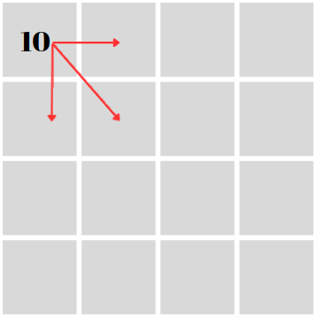
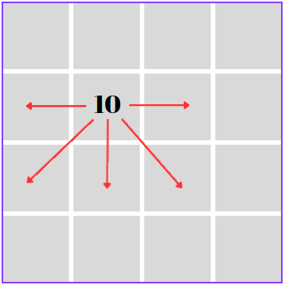
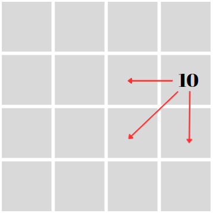
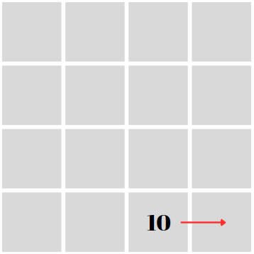
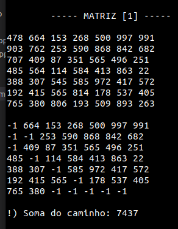
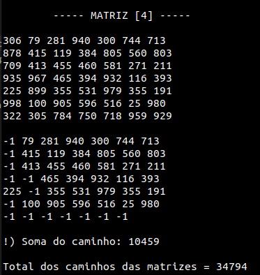

# AEDS: Caminho Guloso

A pedido do professor de Algoritmos e Estruturas de dados do CEFET - Divinópolis, foi feito um algoritmo em C++, que de forma gulosa ande por uma determinada matriz e como saída informa o caminho e valor percorrido.

# Objetivos

Esse algoritmo tem como objetivo pegar N matrizes quadradas do tamanho TxT e prepará-las para o processamento. A partir da primeira matriz se inicia o percurso em uma determinada posição, e ao final de cada matriz é exibido o somatório dos números que fizeram parte do percurso, quando ler as N matrizes também será exibido o somatório do percursos de todas as matrizes.

# Condições do Algoritmo

  <ul>
    <li> Criar um sistema que leia K matrizes quadradas no tamanho NxN.</li>
    <li> Seu programa deve enumerá-las, de forma a deixá-las organizadas para processamento. </li>
    <li> Partindo da primeira matriz, você deve iniciar de um ponto preestabelecido, esse pode ser fornecido pelo usuário ou estar contido em arquivos extras de configuração. Não é permitido definir diretamente no código.</li>
    <li> A partir da primeira matriz, você tem como regras: (a) avançar para a próxima coluna; (b) retroceder para coluna anterior; (c)  saltar para a linha de baixo; (d) ir em diagonal para baixo. Todas essas regras só se aplicam se a casa (posição i,j da matriz) ainda não tenha sido descoberta ou já processada.</li>
    <li> Para caminhar você deve sempre optar pelo valor da próxima casa, valor esse que deve ser o maior dentre eles. Caso haja empate entre casas, crie uma regra para adotar sempre uma mesma decisão de caminhamento.</li>
    <li> Ao alcançar a última linha e coluna da matriz, selecione a próxima matriz e repita todo o processo novamente. Por fim, apresente ao usuário qual foi o caminho adotado e qual a soma obtida do caminho realizado</li>
  </ul>

## Especificações do Arquivo de Entrada

<ul>
 <li>1 - A primeira linha deve ser destinada a dizer o tamanho das matrizes</li>
 <li>2 - Como já citado as matrizes tem que ser quadráticas.</li>
 <li>3 - Cada matriz deve ser separada por uma linha vazia entre elas.</li>
 <li>4 - Os números de cada posição devem ser separado por um espaço que define a troca de coluna da matriz.</li>
 <li>5 - Para trocar a linha da matriz deve passar para próxima linha do arquivo.</li>
</ul>

# Lógica

<strong>Com a matriz inicialmente na posição [0][0].</strong>

<li>Para todos os casos que tiver na primeira coluna da matriz o algoritmo vai comparar apenas os valores de direita, diagonal direita e baixo. Dentre esses valores o maior será selecionado e passará a ser a nova posição.</li>

    

<li> Nos casos em que a posição se encontre após a primeira coluna, mas antes da última coluna da matriz, todos as direções serão comparadas (direita,esquerda,diagonal esquerda,diagonal direita,baixo) e a de maior valor passará a ser a nova posição.</li>

    

<li> Nos casos em que a posição se encontre na última coluna, mas antes da última linha da matriz, as direções esquerda,diagonal esquerda e baixo serão comparadas e a de maior valor passará a ser a nova posição.</li>

    

<li> No caso que chegar a linha final nenhuma comparação será feita, apenas direita até o fim da matriz.</li>

    

## Em caso de valores iguais 

A preferência foi definida para sempre que as posições futuras forem iguais entre si, escolher a que pula uma linha (diagonal direita, diagonal esquerda e baixo), em caso de todos os números ao redor forem iguais a preferência será baixo para assim pular a linha.

# Arquivos e Funções

* `input.data`: arquivo onde as matrizes que serão processadas estão salvas.
* `main.cpp`: arquivo responsável por inicializar a alocação dinâmica da matriz, pegar o tamanho das matrizes (através de uma função `int lerTamanhoMatriz()`) e passar como parâmetro para a função `lerMatriz(matriz,tamanho)`.
* `matriz.hpp`: arquivo onde está declarado todas as funções que serão usadas no arquivo `matriz.cpp`.
* `matriz.cpp` : arquivo que estão as funções que serão explicadas abaixo.

## Funções

* `int lerTamanhoMatriz()`: ela abre o arquivo input.data e percorre para ler o tamanho das matrizes, essa função transforma para o tipo int a string que esta especificando o tamanho da matriz. No final fecha o arquivo e retorna o valor;
* `void lerMatriz(int** matriz, int tamanho)`: primeiramente ela inicializa a matriz dinamicamente (com -1) através da função `void iniciarMatriz(int** matriz, int tamanho)`, logo ela abre o arquivo para ler a primeira linha e começa a ler as matrizes, lendo cada caractere até o espaço e transformando eles para o tipo int e salvando na matriz criada dinamicamente. Dentro dessa mesma função é chamada outra, a `void andarMatriz(int** matriz, int tamanho)` assim que a última linha e coluna for diferente de -1, depois chama a função de iniciar matriz novamente até que tenha lida todas as matrizes do arquivo input.data;
* `void andarMatriz(int** matriz, int tamanho)`: ela vai ser a responsável em andar na matriz, dentro de um while ela acessa as possíveis posições (direita,esquerda,diagonal esquerda,diagonal direita e baixo) de acordo com as limitações da zona que a posição atual estiver. Dentro dessa função é chamado outras, sendo elas: `direita(int** matriz, int i, int j)`, `int esquerda(int** matriz, int i, int j)`, `int baixo(int** matriz, int i, int j)`, `int diagonalDireita(int** matriz, int i, int j)`, `int diagonalEsquerda(int** matriz, int i, int j)`, todas elas retornam os valores ao redor da posição atual que serão usadas para comparar e definir qual será a próxima posição. Ao final é exibido o valor da soma de todos os numeros percorridos dessa matirz;
* `void imprimirMatriz(int** matriz, int tamanho)`: ela apenas imprimi a matriz que é passada como paramentro.

## Especificação das zonas na função `andarMatriz(int** matriz, int tamanho)`

  

De acordo com a zona da posição existe um tratamento específico que limita onde será a próxima posição como visto no tópico Lógica.

<ul>
 <li>Zona vermelha: quando a posição estiver na primeira coluna.</li>
 <li>Zona azul: quando a coluna for entre a segunda e a penúltima, mas sem ser a última linha da matriz.</li>
 <li>Zona verde: quando a posição estiver na última coluna.</li>
 <li>Zona amarela: quando a posição estiver na última linha.</li>
</ul>

# Saída
 
Após o make run:

  

Após ler todas matrizes:

  

# Compilação e Execução

Esse pequeno exemplo possui um arquivo Makefile que realiza todo o procedimento de compilação e execução. Para tanto, temos as seguintes diretrizes de execução:

| Comando                |  Função                                                                                           |                     
| -----------------------| ------------------------------------------------------------------------------------------------- |
|  `make clean`          | Apaga a última compilação realizada contida na pasta build                                        |
|  `make`                | Executa a compilação do programa utilizando o gcc, e o resultado vai para a pasta build           |
|  `make run`            | Executa o programa da pasta build após a realização da compilação                                 |

# Contatos

<a>
✉️ <i>lucaslimadeoliveira80@gmail.com</i>
</a>
